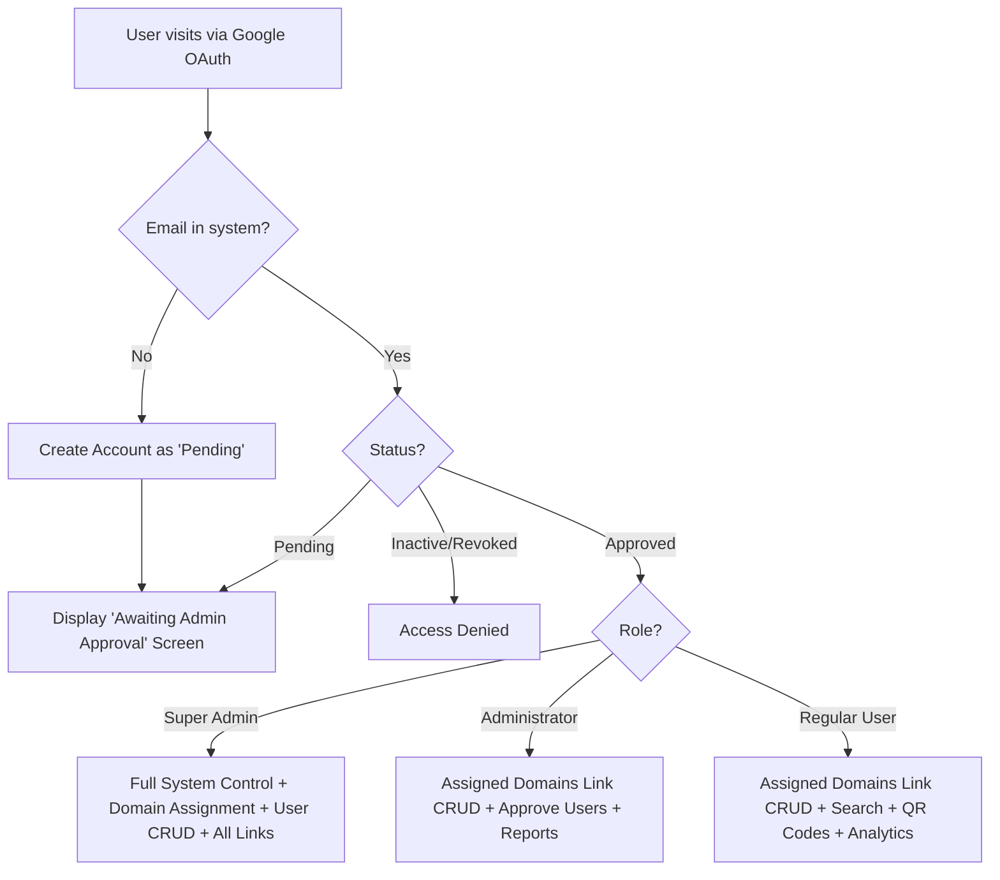
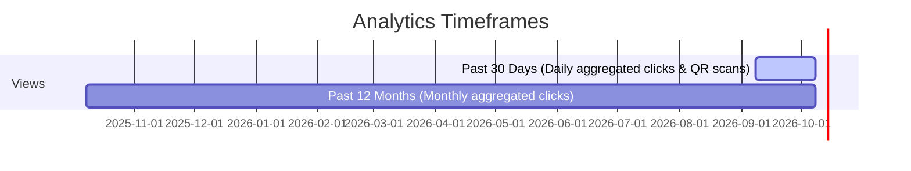
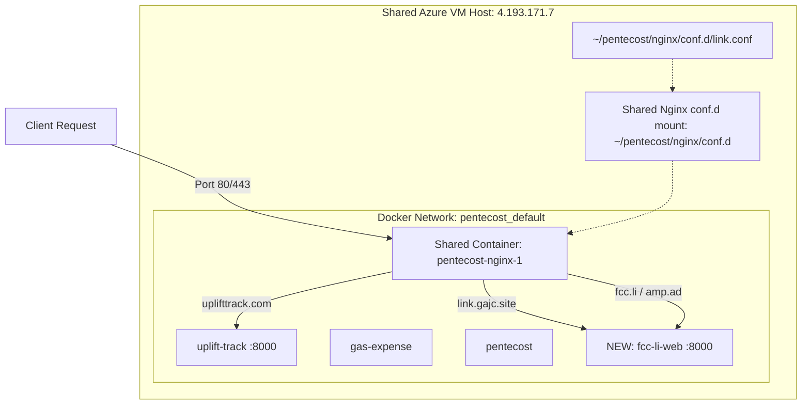

# Product Requirements Document (PRD)
## Project: FCC URL Shortener (`fcc.li` & `amp.ad`)
**Document Version:** 1.1.0  
**Date:** October 8, 2026  
**Status:** Approved / Ready for Build  
**Management & Login Portal Domain:** `link.gajc.site`  
**Production Short Link Domains:** `fcc.li`, `amp.ad`  
**Superuser:** `freecommunitychurchsingapore@gmail.com`  
**Deployment Target:** Shared Azure VM (`azureuser@4.193.171.7`)

---

## 1. Executive Summary & Goals

### 1.1 Background & Motivation
Free Community Church (FCC) and associated ministries currently use **Rebrandly.com** to manage branded short links across two custom domains:
1. `fcc.li` — Free Community Church (`freecomchurch.org`) short link domain (e.g. sermons, worship albums, signup forms, zoom links).
2. `amp.ad` — Amplify Asia Pacific (`amplifyasiapacific.org`) short links for conference materials, regional resources, and community initiatives.

Rebrandly imposes tier limitations, recurring costs, and team seat constraints. By building an in-house URL shortening and link intelligence platform hosted on FCC's existing shared Azure VM, FCC gains full data ownership, unlimited links, custom QR codes, team user approval workflows, granular domain permissions, and seamless integration with existing services without ongoing SaaS subscription fees.

### 1.2 Core Objectives
- **Zero-Disruption Migration:** Seamlessly port existing links (152+ links currently in Rebrandly) without breaking active QR codes or print collateral.
- **Dedicated Management Portal:** Host the login, admin dashboard, analytics, and link management exclusively at `link.gajc.site`.
- **Church Team Access Control:** Google OAuth authentication with an admin approval gate and role management.
- **Domain-Level Authorization:** Superadmin can specify exactly which domains each user or admin has permission to manage.
- **High Performance & Reliability:** Sub-10ms redirection response times with click analytics tracking.
- **Mobile-First Responsive Design:** Seamlessly adapts across desktop, tablet, and narrow-screen smartphones with zero horizontal (left-to-right) scrolling. Navigation collapses into an accessible mobile hamburger drawer.
- **Root Domain Redirection & Future Link Gallery:** 
  - **Phase 1:** `fcc.li/` redirects to `https://freecomchurch.org/`, and `amp.ad/` redirects to `https://amplifyasiapacific.org/`.
  - **Phase 2:** Launch public, branded **Link Galleries** on `fcc.li` and `amp.ad` (curated link-in-bio style showcases).
- **Safe Shared-VM Coexistence:** Strict adherence to existing VM isolation standards (`pentecost_default` Docker network, shared Nginx reload without container recreation, zero impact on `pentecost`, `uplift-track`, or `gas-expense`).

---

## 2. User Roles & Permissions

### 2.1 Role Definitions
| Role | Capabilities | Assignment |
| :--- | :--- | :--- |
| **Super Admin** | Full access to all links, domains, system settings, audit logs, and user management. **Exclusively determines domain access permissions for all users and admins.** Cannot be deleted or downgraded. | Hardcoded default: `freecommunitychurchsingapore@gmail.com` |
| **Administrator** | Manage short links for their assigned domains; approve/reject pending users; upgrade/downgrade regular users to admin; activate/deactivate users. | Granted by Super Admin |
| **Regular User** | View, search, create, and edit short links **strictly for their assigned domains**; view click analytics; generate/download QR codes. | Approved by an Administrator or Super Admin |
| **Pending User** | Can log in with Google, but cannot view, create, or modify links. Lands on a polite waiting room screen: *"Your account is awaiting approval from a church administrator."* | Default state upon first Google Sign-In |
| **Inactive / Revoked** | Blocked from dashboard access. Active short links previously created by this user remain operational. | Marked by an Administrator or Super Admin |

### 2.2 Domain-Level Access Control (Superadmin Managed)
- **Granular Domain Permissions:** Each user account has an explicit `allowed_domains` assignment:
  - `fcc.li` (Free Community Church short links)
  - `amp.ad` (Amplify Asia Pacific short links)
- **Enforcement Rules:**
  - **Superadmin:** Has automatic, unrestricted access to all current and future domains.
  - **Single-Domain User:** If a user is assigned only `amp.ad`, their dashboard, search, analytics, and link creation interface are strictly confined to `amp.ad`. They cannot view or modify `fcc.li` links.
  - **Multi-Domain User:** Users assigned multiple domains can use the domain switcher to toggle between their permitted domains or select "All Assigned Domains".
  - **API Enforcement:** Server-side validation rejects any link creation, update, or deletion for a domain not in the authenticated user's `allowed_domains` list with `403 Forbidden`.

### 2.3 User Management Features (Admin Panel)
- **Pending Approvals Queue:** Notification badge on the Admin menu when pending users exist; single-click approval with role and domain assignment modal.
- **User List & CRUD:** Search users by name/email, view last login timestamp, toggle Active/Inactive, change role (Admin $\leftrightarrow$ Regular User), assign/unassign allowed domains, delete user.
- **Audit Trail:** Basic logging of who approved a user, who altered domain permissions, and who updated link targets.

---

## 3. Link Management & Redirection Engine

### 3.1 Multi-Domain Architecture & Access Enforcement
The platform manages short links across domains:
- **Managed Short Link Domains:** `fcc.li` (Free Community Church) and `amp.ad` (Amplify Asia Pacific).
- **Dedicated Management Portal:** `link.gajc.site` (contains all admin UI, login, API endpoints, and dashboard views).
- **User Domain Scope:**
  - The top-level domain switcher dynamically displays only the domains the current user is permitted to manage.
  - If a user is granted access to only `amp.ad`, `amp.ad` is pre-selected and locked.
  - If a user is granted access to multiple domains (or is Superadmin), they can switch between their allowed domains or select "All Assigned Domains".
- Slugs are scoped per domain (e.g., `fcc.li/zoom` and `amp.ad/zoom` can coexist independently with different destination URLs).

### 3.2 Creating & Editing Links
- **Destination URL:** Validated HTTP/HTTPS URL. Automatic sanitization and trim.
- **Domain Selection:** Dropdown limited strictly to the user's authorized domains.
- **Custom Slug (Back-half):**
  - Custom alphanumeric input with hyphens and underscores allowed (e.g., `album`, `live`, `volunteer-2026`).
  - Auto-generate random friendly slug if left blank (e.g., 6-character nanoid/alphanumeric).
  - Real-time collision checking (instant validation warning if slug already taken on that domain).
- **Auto-Scraped Metadata (Rebrandly parity):**
  - Upon pasting destination URL, background worker fetches page `<title>`, OpenGraph image, and favicon.
  - User can override link title and description for display in the dashboard table.
- **Tags & Categories:** Tag links (e.g., `Worship`, `Donation`, `Sunday Service`, `Youth`, `Social Media`) for fast filtering.
- **Notes Field:** Internal team notes (e.g., *"Used on printed bulletin for October 2026"*).
- **UTM Parameter Builder:** Built-in modal to append `utm_source`, `utm_medium`, `utm_campaign`, `utm_term`, `utm_content`.

### 3.3 Redirection Mechanics & Edge Cases
- **HTTP Status Code:** HTTP `302 Found` or `307 Temporary Redirect` (ensures every click hits the server for analytics without browser permanent-cache skewing).
- **Root Domain Handling (`/`):**
  - **`link.gajc.site/`:** Displays the **FCC URL Shortener Management Portal & Google Sign-In** (or immediate dashboard for logged-in users).
  - **`fcc.li/`:**
    - **Phase 1 (Immediate):** HTTP 302 Redirect to `https://freecomchurch.org/`.
    - **Phase 2 (Link Gallery):** Displays a public, branded **FCC Link Gallery** (a beautiful mobile-friendly link-in-bio page showcasing current FCC highlights: worship album, latest sermon, service livestream, bulletin, giving, prayer requests).
  - **`amp.ad/`:**
    - **Phase 1 (Immediate):** HTTP 302 Redirect to `https://amplifyasiapacific.org/`.
    - **Phase 2 (Link Gallery):** Displays a public, branded **Amplify Link Gallery** (showcasing Amplify Asia Pacific conferences, resources, and community links).
- **404 / Unknown Slug Handling:**
  - Friendly branded error page customized by domain:
    - On `fcc.li`: *"Link not found or expired. Visit Free Community Church at freecomchurch.org"*.
    - On `amp.ad`: *"Link not found or expired. Visit Amplify Asia Pacific at amplifyasiapacific.org"*.
  - Configurable fallback redirect URL per domain.

---

## 4. QR Code Generation Engine

### 4.1 Automated QR Code Creation
- Automatically generated as soon as the link is saved.
- Encodes the canonical short URL (e.g., `https://fcc.li/album`).
- **QR Click Attribution:** Appends an internal tracking query param (e.g., `?src=qr`) or records distinct QR scan events so the analytics engine distinguishes between direct web clicks vs. physical QR scans.

### 4.2 Customization & Export
- **Formats:** High-resolution PNG and vector SVG (crucial for print media, service bulletins, banners, and projection slides).
- **Styling:**
  - FCC Brand colors: Classic Ink (`#14161A`) or FCC Primary Teal (`#1C7678`).
  - Embedded Logo: Incorporates the FCC Dove icon (`fcc-dove-light.svg` / `fcc-dove-1c-ink.svg`) in the center of the QR code.
  - Error correction level set to `Q` or `H` (25–30% redundancy), ensuring the embedded logo does not affect scanability.
  - Live preview in sidebar with one-click "Download SVG" and "Download PNG".

---

## 5. FCC Design System & Brand Asset Integration

The application UI strictly implements the **FCC Design System v1.0** specified in [`freecomchurch.org/03-design-system.md`](file:///c:/Users/gajc/OneDrive/Developer/freecomchurch.org/03-design-system.md) and utilizes the official vector assets located in [`freecomchurch.org/brand/logo/`](file:///c:/Users/gajc/OneDrive/Developer/freecomchurch.org/brand/logo/).

### 5.1 Official Logo Assets (`/freecomchurch.org/brand/logo/`)
| Asset | Source File | Usage in fcc.li |
| :--- | :--- | :--- |
| **Header Wordmark (Light)** | `fcc-A-horizontal-light.svg` | Main dashboard header on light surfaces (FREE & CHURCH in Mulish 800 teal, COMMUNITY in Mulish 300 grey) |
| **Header Wordmark (Dark)** | `fcc-A-horizontal-dark.svg` | Main dashboard header in dark mode (all white vector with transparent body) |
| **App Icon / Favicon** | `fcc-app-icon-light.svg` & `fcc-app-icon-dark.svg` | Browser favicon, PWA manifest icon, touch icons |
| **Dove Emblem** | `fcc-dove-light.svg` / `fcc-dove-1c-ink.svg` | Centered emblem in QR codes, auth/login page banner, empty state illustration |
| **Stacked Lockup** | `fcc-A-stacked-light.svg` | Mobile menu drawer and login card header |

### 5.2 Color Tokens & Theme System
All styles use semantic CSS custom properties defined by the FCC Design System:
- **Teal Palette (Primary):**
  - `teal-600` (`#1C7678`): Primary buttons, active states, focus rings.
  - `teal-700` (`#186668`): Interactive links, hover states.
  - `teal-900` (`#0D393A`): Deep teal header/footer accents.
  - `teal-50` (`#F0F8F8`) & `teal-100` (`#D9EEEE`): Tinted background panels, selected domain pills, tag backgrounds.
- **Dove Gold (Warm Accent):**
  - `gold-500` (`#F8DC29`): Heading accent bars, notification badges with dark text, "look here" callouts. Never used as body text on white.
- **Ink & Neutrals (Surfaces & Typography):**
  - `ink-950` (`#14161A`): Headings, dark theme background.
  - `ink-900` (`#1F2328`): High-contrast body text, dark theme surfaces.
  - `ink-500` (`#5B6168`): Muted meta labels, timestamps, click counts.
  - `ink-200` (`#C4C9CD`) & `ink-100` (`#DDE1E3`): Form input borders and card dividers.
  - `ink-25` (`#F7F8F8`): Subtle section background.
- **Accent Palette (Categories & Ministries from 20th Anniversary Book):**
  - **Coral** (`#E07050` / wash `#FBEDE6`): Pastoral, Sermons, Testimony links.
  - **Saffron** (`#E8A810` / wash `#FBF1D9`): Events, Prayer, Celebrations, Family Day links.
  - **Blue** (`#186088` / wash `#E3EEF4`): Music, Resources, Historical links.
  - **Forest** (`#24704A` / wash `#E4EFE8`): Outreach, Dirty Hands, Community projects.
- **Theme Modes:** Light and Dark themes supported out of the box with system auto-detection and a persistent user switch (Light / Dark / Auto).

### 5.3 Typography Standards
- **Primary Typeface:** **Mulish** (variable 300–800).
- **Hierarchy:**
  - Page Titles: Mulish 800, sentence case (`text-h1`).
  - Section Titles: **Mulish 800 italic, lowercase** (FCC's signature style from the 20th Anniversary Book, e.g., *"short links"*, *"click performance"*, *"active team"*).
  - Badges & Eyebrows: Mulish 800 uppercase with `+0.16em` letter-spacing (`text-label`).
  - Data & Metrics: `font-variant-numeric: tabular-nums` for click counts, percentages, and dates.
- **Icons:** **Lucide Icons** (1.75px stroke, 20px default).

### 5.4 Shape Language & Component Design
- **Radius Tokens:**
  - `radius-sm` (4px): Cards, table rows, input fields, domain pills, and tags (near-square book aesthetic).
  - `radius-pill` (999px): Primary buttons, search inputs, status badges.
  - `radius-full` (50%): User Google profile avatars, icon buttons.
- **Controls & Accessibility:**
  - Minimum tap target size: 44 × 44px.
  - Focus indicator: 3px solid `--color-focus` with 2px offset (never suppressed).
  - WCAG AA contrast compliance verified across all text and interactive states.

### 5.5 Responsive Layout & Mobile Hamburger Navigation
- **Zero Horizontal Scrolling:** Strict `overflow-x: hidden` viewport constraint on all screens. All tables, search inputs, dialogs, charts, and metric cards fit within narrow viewports (down to 320px width) without horizontal page scroll.
- **Desktop Navigation ($\ge 1024\text{px}$):** Persistent horizontal topbar with logo, domain selector pills, search input, navigation links (Links, Analytics, Team), and user avatar dropdown.
- **Mobile Navigation ($< 1024\text{px}$):**
  - Topbar contracts to 60px height displaying the FCC logo/wordmark, "+ New Link" pill button, and an accessible **Hamburger Menu Toggle** (`aria-expanded`, tap target $\ge 44 \times 44\text{px}$).
  - Tapping the hamburger button opens a smooth slide-in mobile drawer or overlay sheet containing:
    - **Domain Switcher:** Large, touch-friendly pill buttons to switch between allowed domains (`fcc.li`, `amp.ad`).
    - **Main Navigation:** Direct links to Links Manager, Click Analytics, Team Approvals & Roles (Admin only).
    - **User Profile & Controls:** User email display, role badge, theme switcher (Light / Dark / Auto), and Sign Out button.
- **Responsive Table & Card Adapters:** On mobile devices, the dense desktop link list seamlessly reformats into touch-friendly cards or stacked list rows, ensuring slug, destination snippet, click count badge, and action trigger are visible without horizontal panning.

---

## 6. Analytics & Reporting

### 5.1 Per-Link Reports (Rebrandly Parity)
- **Time Filters:**
  - **Past 30 Days:** Daily bar chart showing click volume day-by-day.
  - **Past 12 Months:** Monthly bar chart showing long-term trends.
  - **Past 24 Hours / All-time summary.**
- **Key Metrics:**
  - Total clicks received.
  - QR Code scans vs. direct link clicks.
  - Clicks today.
  - Last click timestamp / relative time (e.g., *"2 hours ago"*).
- **Visitor Dimensions:**
  - Referrer domain (e.g., Instagram, Facebook, Direct / Email, WhatsApp).
  - Device type (Mobile, Desktop, Tablet).
  - Top countries / regions (via Cloudflare/Nginx headers or lightweight GeoIP).
- **Export:** Export link click data to CSV.

### 5.2 Global Dashboard Analytics
- Total clicks across all links and domains.
- Top 10 most visited short links.
- Filterable by domain (`fcc.li` vs `amp.ad`).

---

## 6. Porting from Rebrandly: Migration & Enhanced Features

Based on the Rebrandly dashboard screenshots and operational requirements, the following migration and parity features are included:

| Feature | Rebrandly Capability | FCC Custom Service Feature | Priority |
| :--- | :--- | :--- | :--- |
| **CSV Migration Import** | Export links to CSV | Dedicated import tool parsing Rebrandly CSV (Domain, Slug, Destination URL, Title, Tags, Historical Click Count) | **P0 (Must-have)** |
| **Instant Slug Search** | Global search box | Header search with instant fuzzy filter by slug, title, and target URL | **P0 (Must-have)** |
| **Favicon & Title Scraping** | Automatic link preview | Automatic background parser fetching title & favicon for visual table list | **P1 (High)** |
| **Tags Management** | Tagging system | Color-coded badges for church ministries / campaigns | **P1 (High)** |
| **Link Status Toggle** | Enable / Disable | Pause a link temporarily without deleting it | **P1 (High)** |
| **UTM Builder** | Built-in modal | Generate standard Google Analytics campaign parameters | **P2 (Nice-to-have)** |
| **Bulk CSV Export** | Rebrandly export | One-click export of all links and stats for backups | **P1 (High)** |

---

## 7. System Architecture & Tech Stack

### 7.1 Confirmed Tech Stack & Database
- **Backend Framework:** **Python 3.12 + FastAPI (Async)**
  - Uvicorn ASGI server with Gunicorn process manager.
  - Ultra-fast redirection overhead (<3ms).
  - Native async database driver with SQLModel / SQLAlchemy 2.0 (asyncio).
  - Background task worker for fetching page metadata (title, OpenGraph preview, favicon).
  - SVG and PNG QR code generation with high error-correction (`segno` / `qrcode`).
- **Database:** **Local Volume-Mounted SQLite with WAL Mode**
  - Path on VM: `/home/azureuser/apps/fcc.li/data/app.db` (mounted into `/app/data/app.db`).
  - **WAL (Write-Ahead Logging)** mode enabled for concurrent, lock-free reads and high-throughput logging.
  - Total isolation: zero risk to shared MySQL or other containers on the VM.
  - Instant zero-downtime backups via automated `sqlite3 .backup` scripts.
- **Frontend & UI:**
  - Responsive, modern dashboard matching the Rebrandly aesthetic (curated dark/light theme, modern typography, SVG icons).
  - Chart.js for 30-day and 12-month analytics bar charts.
  - Vanilla JS + clean responsive component architecture (zero heavy node runtime build steps needed for production).
- **Authentication:**
  - Google Identity Services (OAuth 2.0 Authorization Code flow).
  - Secure signed HTTP-only session cookies.

### 7.2 Domain Routing & Root Handling (Confirmed)
- **Management Portal (`link.gajc.site`):**
  - Displays the branded **FCC URL Shortener Portal & Google Sign-In** for visitors.
  - Logged-in users immediately access their admin dashboard and link manager.
- **Short Link Redirection Domains (`fcc.li`, `amp.ad`):**
  - Resolves any valid slug (e.g., `fcc.li/album`, `amp.ad/starter05`) with high-speed temporary redirect + click tracking.
  - **Root URL (`/`):**
    - **Phase 1:** Redirect `fcc.li/` $\rightarrow$ `https://freecomchurch.org/` and `amp.ad/` $\rightarrow$ `https://amplifyasiapacific.org/`.
    - **Phase 2:** Render public, branded **Link Galleries** directly on `fcc.li` and `amp.ad`.

### 7.3 Shared-VM Deployment Architecture (Confirmed)
- **Container Name:** `fcc-li-web`
- **Docker Network:** `pentecost_default` (external).
- **Host Ports:** None published directly to host (internal proxy only).
- **Reverse Proxy:** Shared `pentecost-nginx-1` with config at `pentecost/nginx/conf.d/link.conf`.
- **Target Management Domain:** `https://link.gajc.site` (with Let's Encrypt SSL via webroot `/var/www/pentecost`).
- **DNS & IP Mapping:**
  - **Portal (`link.gajc.site`):** `4.193.171.7` (Confirmed resolved & active).
  - **Current Rebrandly IP (`fcc.li` & `amp.ad`):** `52.72.49.79`.
  - **Cutover Strategy:** All links, OAuth authentication, user management, and analytics are deployed and verified on `link.gajc.site`. Once validated, DNS A records for `fcc.li` and `amp.ad` will be switched from `52.72.49.79` to `4.193.171.7`. Let's Encrypt certificates will be acquired via webroot `/var/www/pentecost` and server blocks for `fcc.li` and `amp.ad` enabled in Nginx.

#### Shared VM Safety Rules (Derived from `uplift-track/deploy.sh`):
1. **Network Attachment Only:** Container joins external network `pentecost_default`.
2. **Zero Published Host Ports:** No `ports: - 8000:8000` on host; communication with Nginx happens strictly through Docker's internal DNS resolver (`http://fcc-li-web:8000`).
3. **Nginx Config Isolation:**
   - Drop file `pentecost/nginx/conf.d/link.conf`.
   - Never edit the main `nginx.conf` or other sites' `.conf` files.
   - Always run `docker exec pentecost-nginx-1 nginx -t` before `nginx -s reload`.
4. **SSL / Certbot Integration:**
   - Use Let's Encrypt webroot: `/.well-known/acme-challenge/` mapped to `/var/www/pentecost` (host path `/home/azureuser/pentecost/web`).
   - Run certbot renewal test without stopping Nginx.
5. **Git Archive Deployment:** Deploy clean committed tree to `apps/fcc.li` on the VM via SSH.

---

## 8. Resolved Design Decisions & Operational Configurations

All preliminary design decisions have been resolved and agreed upon:

| Decision Area | Status | Resolution |
| :--- | :--- | :--- |
| **Backend Framework** | **Resolved** | **Python 3.12 + FastAPI (Async)** for sub-3ms redirects, async SQLite driver, and clean single-container deployment. |
| **Database Engine** | **Resolved** | **Volume-mounted SQLite with WAL mode** (`/app/data/app.db`). Completely isolated, zero impact on shared MySQL, automated `.backup` snapshots. |
| **Portal Domain** | **Resolved** | **`link.gajc.site`** exclusively hosts the Login Portal, Admin Dashboard, Link Management, and Analytics. `fccli.gajc.site` is retired and never used. |
| **Root URL Behavior** | **Resolved** | **Phase 1:** `fcc.li/` $\rightarrow$ `https://freecomchurch.org/`, `amp.ad/` $\rightarrow$ `https://amplifyasiapacific.org/`. **Phase 2:** Public, branded **Link Galleries** on `fcc.li` and `amp.ad`. |
| **Slug Namespace** | **Resolved** | **Isolated per domain**. Each domain maintains its own independent slug space (e.g., `fcc.li/zoom` and `amp.ad/zoom`). |
| **Domain Authorization** | **Resolved** | **Superadmin managed**. The default Super Admin (`freecommunitychurchsingapore@gmail.com`) assigns allowed domain permissions per user and admin. |
| **Design System & Branding** | **Resolved** | Strictly adheres to **FCC Design System v1.0** ([`03-design-system.md`](file:///c:/Users/gajc/OneDrive/Developer/freecomchurch.org/03-design-system.md)), using vector logos from `/freecomchurch.org/brand/logo/`, Mulish typography, 4px card radius, and brand teal/gold tokens. |
| **Shared VM Safety** | **Resolved** | Joins external network `pentecost_default`, publishes no host ports, reverse-proxied by `pentecost-nginx-1` via `/etc/nginx/conf.d/link.conf`. |
| **Rebrandly Migration** | **Resolved** | Built-in CSV migration importer accepting Rebrandly exports (Domain, Slashtag/Slug, Destination URL, Title, Tags, Historical Click Count). |
| **Google OAuth & Dev Mode** | **Resolved** | Production uses Google OAuth 2.0 with redirect URI `https://link.gajc.site/auth/google/callback`. A development switch (`DEV_AUTH_BYPASS=true`) is included for seamless local testing without external Google Cloud dependencies. |

---

## 9. Phased Implementation Roadmap

- **Phase 1: Core Engine, Management Portal & Deployment (`link.gajc.site`)**
  - Project setup inside `fcc.li/` (FastAPI, SQLite WAL, Dockerfile, `deploy.ps1`).
  - Multi-domain database models (Users, Domains, Links, Clicks, Tags, AllowedDomains).
  - High-speed redirection engine (<3ms) with click logging and User-Agent/referrer parsing.
  - Phase 1 root redirects: `fcc.li/` $\rightarrow$ `freecomchurch.org`, `amp.ad/` $\rightarrow$ `amplifyasiapacific.org`.
  - Google OAuth integration & Superadmin auto-approval (`freecommunitychurchsingapore@gmail.com`).
  - User approval queue, domain assignment, and role management.
  - Rebrandly-style dashboard adhering to FCC Design System v1.0 (Mulish, brand teal/gold, 4px cards).
  - QR Code generator with FCC Dove emblem overlay and SVG/PNG download.
  - 30-day and 12-month Chart.js analytics reports.
  - Rebrandly CSV import tool.
  - Deploy to shared Azure VM at `https://link.gajc.site` (Nginx `link.conf` + SSL certbot).
- **Phase 2: Link Gallery & Production Cutover (`fcc.li` & `amp.ad`)**
  - Build the public **Link Gallery** module for `fcc.li` and `amp.ad` (link-in-bio showcasing curated church & ministry resources).
  - Admin management for Link Gallery items, ordering, and themes.
  - Switch DNS A records for `fcc.li` and `amp.ad` from `52.72.49.79` $\rightarrow$ `4.193.171.7`.
  - Issue Let's Encrypt certificates for `fcc.li` and `amp.ad` and update Nginx reverse proxy.
